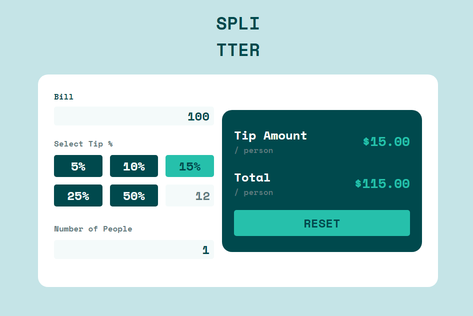

# Frontend Mentor - Tip calculator app

This is a solution to the [Tip calculator app on Frontend Mentor](https://www.frontendmentor.io/challenges/tip-calculator-app-ugJNGbJUX). 

## Table of contents

- [Overview](#overview)
  - [The challenge](#the-challenge)
  - [Screenshot](#screenshot)
- [My process](#my-process)
  - [Built with](#built-with)
- [Author](#author)
- [Requisite](#requisite)
  - [Running](#running)

<br>

## Overview

### The challenge

Users should be able to:

- View the optimal layout for the app depending on their device's screen size
- See hover states for all interactive elements on the page
- Calculate the correct tip and total cost of the bill per person


### Screenshot

<h1 align="center">
  
</h1>

<br>

## My process

### Built with

- Framework JavaScript - VueJS

<br>

## Author

- Linkedin - [Ian Hadrien](https://www.linkedin.com/in/ian-hadrien-8051181b1/)

<br>

## Project setup
```
npm install
```

### Compiles and hot-reloads for development
```
npm run serve
```

### Compiles and minifies for production
```
npm run build
```

### Customize configuration
See [Configuration Reference](https://cli.vuejs.org/config/).
